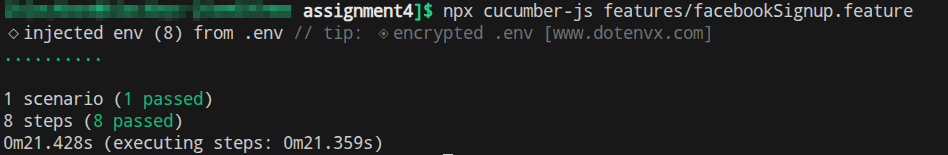

# Assignment 4

I choose Option 3: automate Facevook sign up

[Link](https://www.facebook.com/signup) to the form

## Run

1. Create `.env` file with the following format:
```
FB_TEST_FIRSTNAME=Robotina
FB_TEST_SURNAME=Robotika
FB_TEST_EMAIL=
FB_TEST_PASSWORD=
FB_TEST_BIRTH_DAY=15
FB_TEST_BIRTH_MONTH=May
FB_TEST_BIRTH_YEAR=2000
FB_TEST_GENDER=Female
```

For `FB_TEST_EMAIL` and `FB_TEST_PASSWORD` use valid email and password. If email or password is not valid the last step will fail.

2. Run with a command

    ```bash
    [... assignment4]$ npx cucumber-js features/facebookSignup.feature
    ```

3. After successful run you will see confirmation in terminal:

